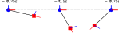

PyKinSim ‒ Python Kinematic Chain Simulator
============================================




***PyKinSim* is a Python library simulating rigid kinematic chains,
such as pendulums, robotic arms, or skeletons.** *PyKinSim* uses Lagrangian
mechanics to accurately simulate the effects of gravity, as well as the preservation
of momentum. It features a simple API for the description and simulation of
kinematic chains.

## Example

A single code snippet is often worth more than a thousand words! Hence, the
following example shows how to describe, simulate, and visualize a simple
pendulum using *PyKinSim*.

```python
import pykinsim as pks

# Construct the kinematic chain
with pks.Chain() as chain:
    f1 = pks.Fixture()       # A fixture is an object that does not move
    j1 = pks.Joint(axis="y") # A rotational joint along the y-axis
    m1 = pks.Mass(m=1.0)     # A mass of 1kg

    pks.Link(f1, j1, l=0.0)  # Place the joint directly at the fixture
    pks.Link(j1, m1, l=1.0)  # A link with length 1m

# Build the underlying simulator and run the simulation
with pks.Simulator(chain, root=f1) as sim:
    state = sim.initial_state()
    for i in range(3):
        # Advance the simulation for T=0.25s
        state = sim.run(0.25, state)

        # Draw the pendulum to a figure using matplotlib
        vis = sim.visualize(state, "matplotlib")
        vis.fig.savefig("pendulum_{}.svg".format(i), bbox_inches="tight", transparent=True)
```

Executing this will roughly result in the picture displayed in the header above
(the individual plots were combined for clarity). The rotational joint is
depicted as a blue circle, the mass as a red square. The coloured lines
correspond to the local (3D) coordinate system of each object.

The code snippet above should be enough to get you started. See the `examples`
folder for more models.

## Features

*PyKinSim* is designed to be fairly minimal, with a simple API. It focuses on rigid connections between point masses with rotational

* **Rigid body simulation using Lagrangian mechanics**  
  *PyKinSim* is using Lagrangian mechanics to accurately describe the motion of the objects in the system under the influence of gravity.
* **Symbolic and numeric computation**  
  *PyKinSim* can either solve the dynamics of a system numerically, or provide a symbolic description of the forward kinematics, Jacobian matrices (TBD), Lagrangian, and the dynamics of the system.
* **Four object types**  
  * *Point objects:*  `Joint` (rotational joints around a 3D axis), `Fixture` (a point with no or constrained movement), `Mass` (a point mass)
  * *Links:* `Link` (connects two point objects)

## Installation and Dependencies

*PyKinSim* requires at least Python 3.8 and depends on a recent version of `numpy` and `sympy`. To make use of the `matplotlib` visualization type, you need to install `matplotlib`. To install `pykinsim`, just run the following command in the root directory of the repository (note that, depending on your installation, `pip3` might be called `pip` instead).
```
pip3 install -e .
```

Alternatively, you can use `pipenv` to run setup a virtual environment for this project; just run the following in the root directory of the repository.
```sh
pipenv install
```
See the `pipenv` documentation for more information.

Pull requests for improving the compatibility of `pykinsim` with older versions of Python 3 or numpy and sympy are welcome!

## License

pykinsim ‒ Python Kinematics Simulator<br/>
Copyright (C) 2020  Andreas Stöckel

This program is free software: you can redistribute it and/or modify
it under the terms of the GNU General Public License as published by
the Free Software Foundation, either version 3 of the License, or
(at your option) any later version.

This program is distributed in the hope that it will be useful,
but WITHOUT ANY WARRANTY; without even the implied warranty of
MERCHANTABILITY or FITNESS FOR A PARTICULAR PURPOSE.  See the
GNU General Public License for more details.

You should have received a copy of the GNU General Public License
along with this program.  If not, see <https://www.gnu.org/licenses/>.
