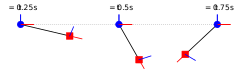

PyKinSim ‒ Python Kinematic Chain Simulator
============================================

***PyKinSim* is a small Python library for simulating rigid kinematic chains,
such as pendulums, robotic arms, or skeletons.** *PyKinSim* uses Lagrangian
mechanics to accurately simulate the effects of gravity, as well as the preservation
of momentum. It features a simple API for the description and simulation of
kinematic chains.

## 🚀 Example



A single code snippet is often worth more than a thousand words! Hence, the following example shows how to describe, simulate, and visualize a simple pendulum using *PyKinSim*.

```python
import pykinsim as pks

# Construct the kinematic chain
with pks.Chain() as chain:
    f1 = pks.Fixture()       # A fixture is an object that does not move
    j1 = pks.Joint(axis="y") # A rotational joint along the y-axis
    m1 = pks.Mass(m=1.0)     # A mass of 1kg

    pks.Link(f1, j1, l=0.0)  # Place the joint directly at the fixture
    pks.Link(j1, m1, l=1.0)  # A link with length 1m

# Build the underlying simulator and run the simulation
with pks.Simulator(chain, root=f1) as sim:
    state = sim.initial_state()
    for i in range(3):
        # Advance the simulation for T=0.25s
        state = sim.run(0.25, state)

        # Draw the pendulum to a figure using matplotlib
        vis = sim.visualize(state, "matplotlib")
        vis.fig.savefig("pendulum_{}.svg".format(i), bbox_inches="tight", transparent=True)
```

Executing this will roughly result in the picture displayed in the header above (the individual plots were combined for clarity).

## Features

TODO

## License

AGPLv3
